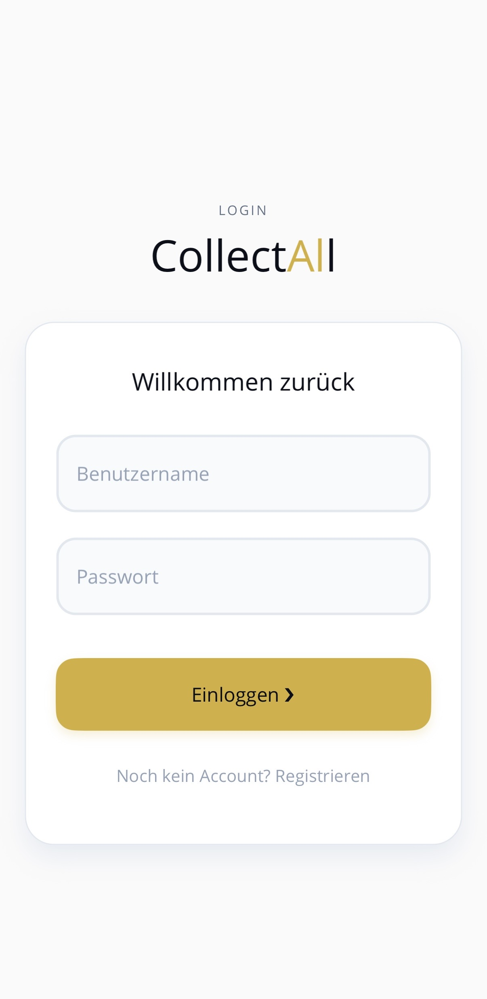
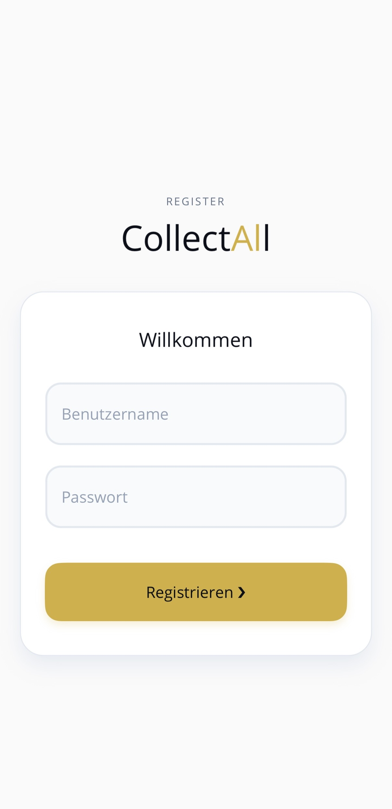
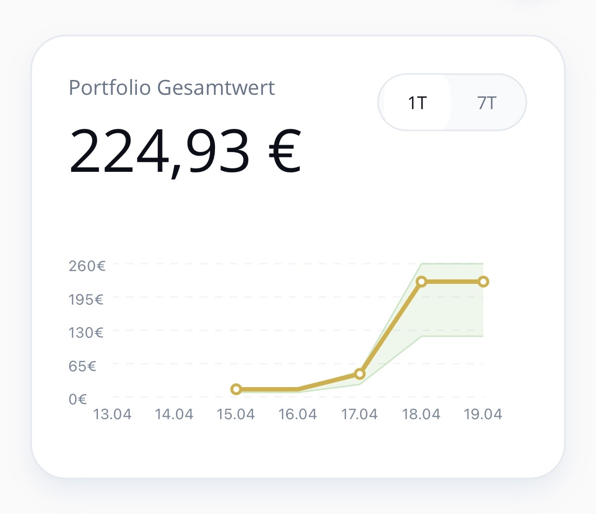
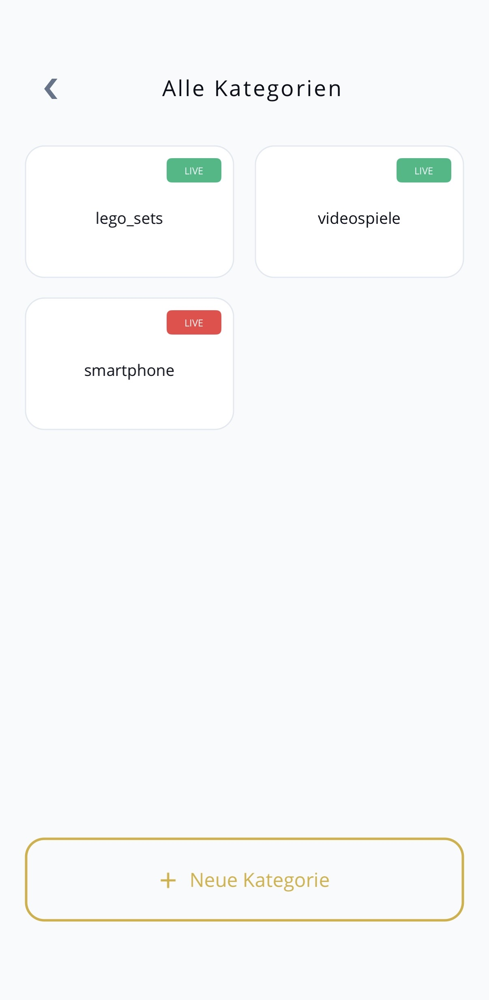
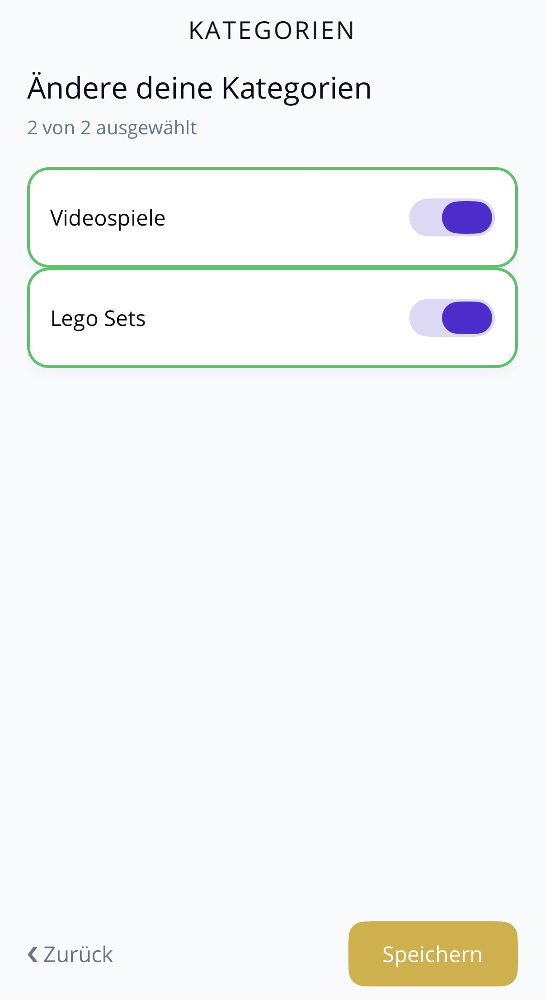
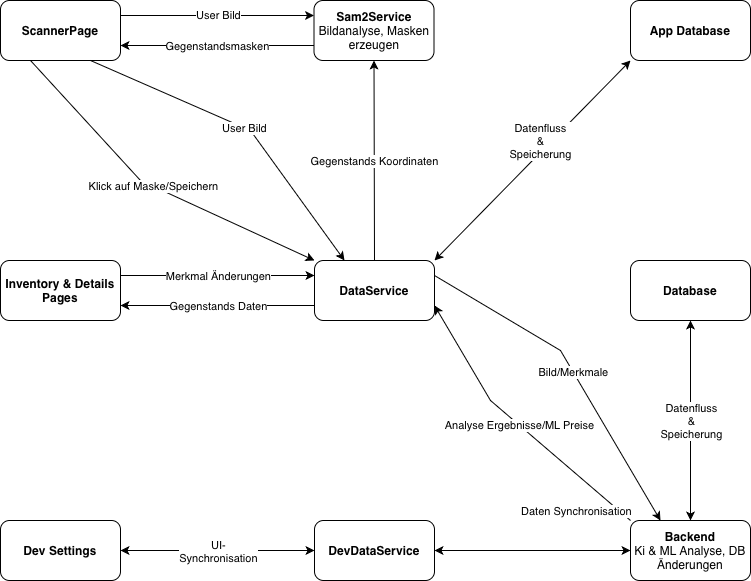

# CollectAll

Smartphone-App zur automatisierten Erkennung und Wertschätzung von Gegenständen per Kamera-Scan.

## Einleitung
CollectAll erkennt und segmentiert Gegenstände auf Fotos, schätzt deren Marktwert und speichert sie in einer lokalen Sammlung.

> 🚧 **Projekt-Status:** 
> Dieses Repository dient aktuell als Architektur- und Konzept-Dokumentation für das Frontend. Der eigentliche Source-Code wird in Kürze in diesem Repository veröffentlicht. Das Backend (FastAPI, KI-Pipelines) ist bereits live im Einsatz.

### 🛠 Tech Stack

**Frontend**

**Backend**

**KI & Machine Learning**

## App Demo
<video src="assets/CollectAll_Demo.mov" width="250" controls></video>

## Features

### 1. Security & Auth
Der Zugriff auf das Backend ist zweifach abgesichert:
* **User-Auth:** Login und Registrierung laufen stateless über **JWT Tokens**.
* **API-Schutz:** Alle Endpunkte prüfen zusätzlich einen App-spezifischen Schlüssel (X-App-Access-Key).

<table align="center">
  <tr>
    <td align="center" style="border: none;">
       
      Login
    </td>
    <td align="center" style="border: none;">
       
      Registrierung
    </td>
  </tr>
</table>

### 2. Kamera-Scan
Der Scan-Prozess nutzt eine hybride Architektur aus On-Device-KI und Cloud-Modellen:

* **SAM 2 Tiny (Lokal):** Das Bild wird direkt auf dem Smartphone via Meta's SAM 2 Modell für die Segmentierung vorbereitet.
* **FastAPI & Gemini (Cloud):** Der Bildstring wird an das Backend geschickt. Ein Gemini-Modell analysiert den Inhalt.
* **Caching-Strategie:** Zur Performance-Optimierung werden die Daten in 11 separaten Caches verwaltet und auf Englisch an die Gemini-API übergeben. Die finale Ausgabe wird danach automatisiert ins Deutsche übersetzt.
* **Semantic Matching & Token-Reduzierung:** Gezielt für Gegenstandsnamen und offene Attribute (z. B. Filme) wird auf den Versand ressourcenintensiver Listen verzichtet. Die finale Zuweisung erfolgt zweistufig: Gemini generiert eine konzeptionelle Vorhersage, die anschließend von einer lokalen Vector Search-Pipeline (Sentence Transformer) semantisch dem korrekten Datensatz zugeordnet wird.
* **Koordinaten-Mapping:** Das Backend liefert Analysedaten und Koordinaten zurück. 
* **SVG-Masken:** SAM 2 erzeugt aus den Koordinaten SVG-Pfade, wodurch die Gegenstände im UI interaktiv hervorgehoben werden.
* **Validierung & SQLite:** Ein Klick auf eine Maske öffnet die Detailansicht. Hier können Merkmale angepasst werden (löst Neuschätzung aus), bevor der Gegenstand lokal in einer SQLite-Datenbank gespeichert wird.

### 3. Preis-Schätzung & Machine Learning
Die komplette Logik der Wertermittlung läuft entkoppelt im Backend ab:

* **Background Tasks:** Bestimmte Checkpoints während der Bildanalyse triggern asynchrone Hintergrundprozesse.
* **Echtzeit-Datenbank:** Über Gemini (inklusive Google Search) werden reale Verkaufsergebnisse des Gegenstands ermittelt und in die Datenbank geschrieben.
* **Dynamic Training & Fallback-Logik:** Periodisches, automatisiertes Training individueller XGBoost-Modelle. Zur Lösung des Cold-Start-Problems (bei zu geringer Datenmenge) wird die Gemini-KI als zuverlässiger Fallback für die Preisschätzung genutzt.
* **Dynamisches Attribut-System:** Gegenstände verfügen über anpassbare, typspezifische Merkmale. Das Frontend reagiert flexibel auf die Datenstruktur und nutzt optimierte UI-Komponenten: native Picker für Enums/Festwerte und eine integrierte Search-Pipeline für relationale Datenpunkte wie z. B. Filme.
* **Live-Inference:** Jede manuelle Änderung eines Merkmals in der App triggert sofort eine neue Preisschätzung durch dieses trainierte Modell oder im Fallback Fall einem Gemini Call.

### 4. Sammlungsverwaltung & Navigation
Die App nutzt eine hierarchische Struktur zur effizienten Verwaltung der gespeicherten Gegenstände:

* **Sammlungs-Einstieg:** Von der Hauptseite aus gelangt der Nutzer in die globale Übersicht aller Kategorien.
* **Kategorie-Ansicht:** Innerhalb einer Kategorie werden alle zugeordneten Gegenstände als übersichtliche Kachel-Liste dargestellt.
* **Detail-Ansicht:** Ein Klick auf eine Kachel öffnet die vollständige Datenansicht (Bild, Name, Merkmale). 
* **Mehrsprachigkeit:** Die Benutzeroberfläche ist komplett auf Deutsch und Englisch verfügbar. Die Sprache lässt sich nahtlos und ohne Neustart der App in den Einstellungen anpassen.

### 5. Wertentwicklung & Datenvisualisierung

   
  Wertermittlung Beispiel 7 Tage

Die App aktualisiert und visualisiert den Marktwert der Sammlung kontinuierlich:

* **Automatisierte Neuschätzung:** Ein App-Start triggert (maximal einmal pro Stunde) ein automatisches Neuschätzen aller gespeicherten Gegenstände durch die aktuellsten XGBoost-Modelle bei genug Daten.
* **Portfolio-Graphen (Hauptseite):** Visuelle Darstellung der globalen Wertentwicklung der gesamten Sammlung.
* **Kategorie-Graphen:** Aggregierte Darstellung der historischen Preis-Trends einzelner Sammelgebiete.
* **Item-Graphen (Detail-Ansicht):** Detaillierter, historischer Preisverlauf für jeden individuellen Gegenstand.

### 6. Admin-Panel & Konfiguration

   
  Admin Übersicht

Ein rollenbasierter Zugriff schützt die Verwaltungsfunktionen auf der Hauptseite:

* **Admin-Zugang:** Nur autorisierte Administratoren sehen den Einstellungs-Bereich.
* **Datenverwaltung:** Voller Lese- und Schreibzugriff auf alle Systemeinstellungen, Nutzerdaten und Kategorien.
* **Dynamisches Kategorie-Management:** Kategorien, deren spezifische Merkmale sowie die zulässigen Werte können flexibel zur Laufzeit angelegt und modifiziert werden. Auch die exakte Darstellung für den Endnutzer (UI-Labels) lässt sich nahtlos anpassen.
* **Automatisches Live-Deployment:** Die Freischaltung einer Kategorie triggert sofort ein globales Cache-Update. Parallel wird automatisiert ein XGBoost-Modell trainiert, sodass die App die neue Kategorie in Echtzeit und ohne App-Neustart erkennt.

### 7. Abo-Modell & Kategorien wählen

   
  Kategorien Übersicht

Die App bietet verschiedene Abonnement-Stufen, die festlegen, wie viele Kategorien gleichzeitig vom System verarbeitet werden können.

* **Dynamische Kategorie-Auswahl:** Aus einem Pool aller aktuell live geschalteten Kategorien können Nutzer – limitiert durch ihr jeweiliges Abo-Modell – ihr individuelles Set an aktiven Kategorien frei zusammenstellen, welche die App erkennen und speichern soll.

## Architektur & Datenfluss

   
  System-Architektur und Datenfluss

