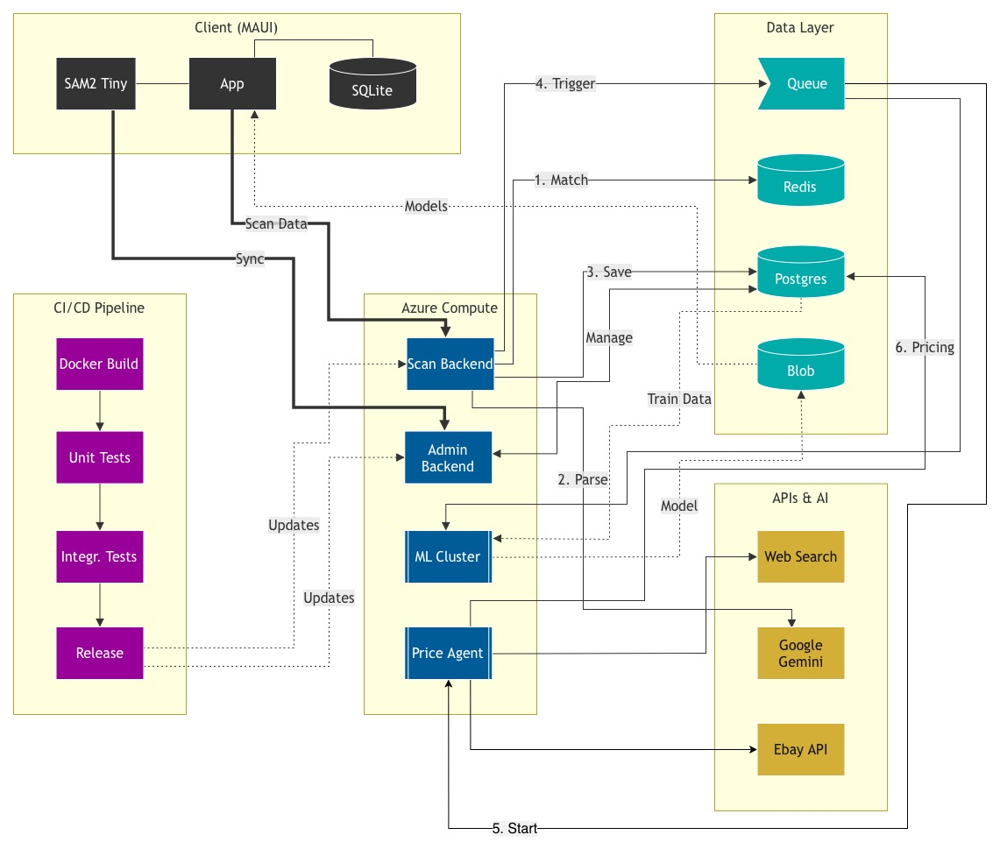
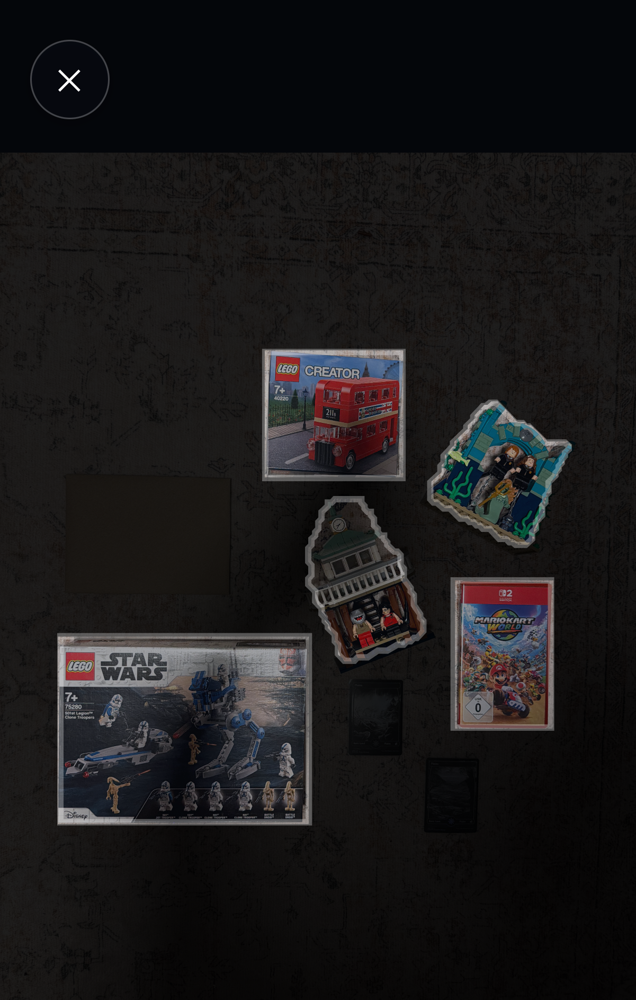
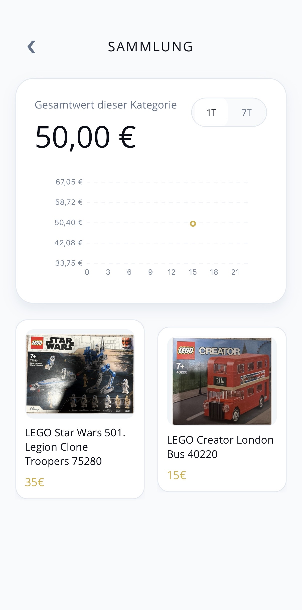
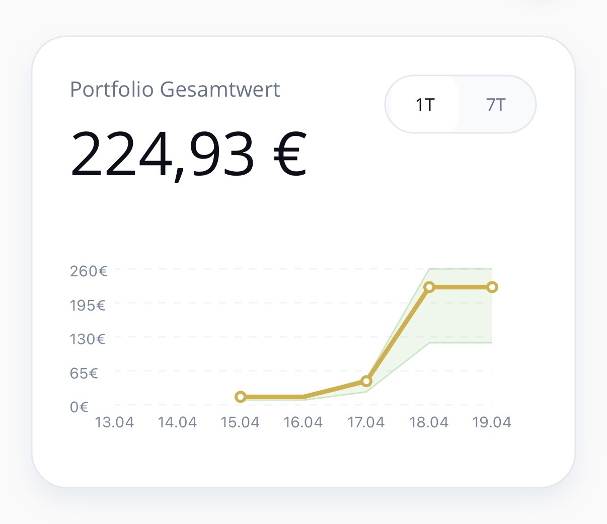
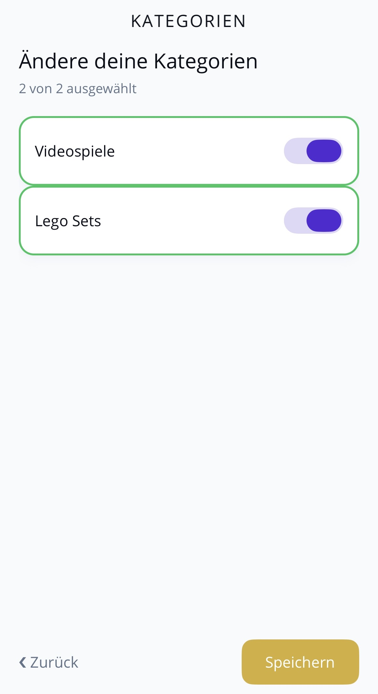
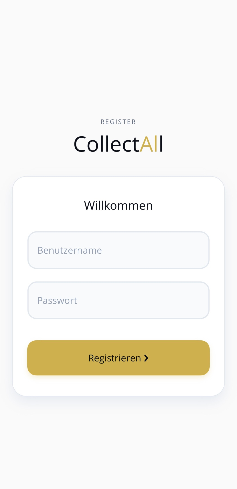
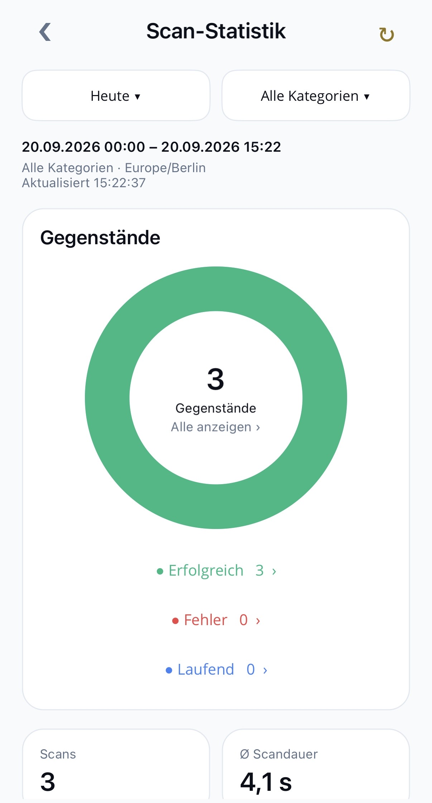
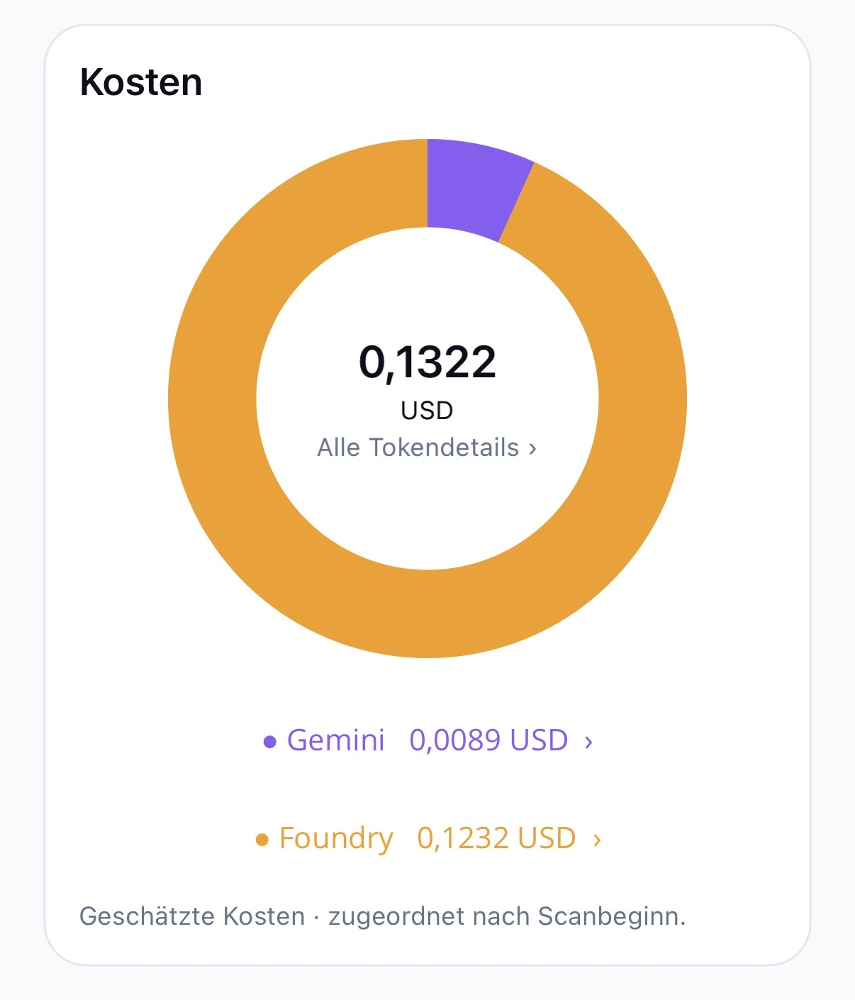

# CollectAll

**Verteiltes KI-System zur Edge-basierten Bildsegmentierung und automatisierten Marktwertschätzung per Kamera-Scan.**

## Einleitung
CollectAll ist eine Full-Stack-Anwendung, die On-Device Machine Learning (SAM 2 Tiny) mit einer asynchronen, cloud-basierten Microservice-Architektur kombiniert. Das System segmentiert Gegenstände auf Fotos, ermittelt deterministisch deren Marktwert über dynamische ML-Modelle und speichert sie in einer lokalen Sammlung.

> 🚧 **Projekt-Status:** > Der Quellcode dieses Projekts ist aktuell privat. Dieses Repository dient als Architektur-Dokumentation und Portfolio-Showcase für Systemdesign, KI-Integration und CI/CD-Pipelines.

### 🛠 Tech Stack

**KI & Machine Learning**

**Backend**

**Cloud & Infrastruktur**

**DevOps & CI/CD**

**Frontend**

---

## App Demo
https://github.com/user-attachments/assets/77950b01-b0fa-4f32-b532-d1c00bd44dd5

---

## Systemarchitektur & Data Flow

Das System basiert auf einer strikten Trennung zwischen mobilem Client, Backend-Services und asynchronen Workern, um Skalierbarkeit und Ausfallsicherheit zu gewährleisten.

   
  High-Level Architektur: Client, Cloud Compute, Data Layer & Pipelines

### Architecture & Design Decisions
Dieses Projekt wurde mit einem starken Fokus auf Kostenoptimierung, Latenzreduzierung und Ausfallsicherheit entworfen:

* **Edge-Compute & Asynchrone Parallelisierung (SAM 2 via ONNX):**  Die rechenintensive Generierung der Bild-Embeddings für die Segmentierung wurde bewusst als ONNX-Modell (Encoder/Decoder) direkt auf das Endgerät des Nutzers ausgelagert. Diese lokale Edge-Inferenz läuft asynchron und exakt parallel zur KI-Analyse im Backend. 
***Die architektonische Herausforderung:***  Um den Scan-Vorgang drastisch zu beschleunigen (überlappende Ladezeiten) und gleichzeitig teure, nutzerproportionale Compute-Ressourcen (GPUs) im Azure-Backend vollständig zu vermeiden, musste die schwere Rechenlast stabil auf die Client-Geräte verteilt werden.

* **LLM Context Caching & Semantic Vector Matching:**  Um API-Kosten (Token-Verbrauch) und LLM-Latenzen drastisch zu reduzieren, wird der umfangreiche System-Prompt intelligent segmentiert. Der statische Master-Prompt sowie die komplexe Kategorien-Taxonomie werden im Modell gecacht (Context Caching). Lediglich die minimalen, nutzerspezifischen Parameter (aktive Kategorien) werden bei jedem Scan dynamisch injiziert. 
***Die architektonische Herausforderung:***  Die direkte Übergabe aller bereits bekannten Gegenstandsnamen oder offener Merkmale (z. B. unzählige Filmtitel) würde das Context Window sprengen. Die Lösung: Auf den Versand dieser riesigen Listen wird komplett verzichtet. Die KI generiert stattdessen eine freie, konzeptionelle Vorhersage. Das Backend vektorisiert diesen generierten Namen direkt zur Laufzeit (via lokaler Sentence Transformers) und nutzt eine Vektor-Suche in Redis, um die KI-Schätzung semantisch und fehlertolerant auf den korrekten, bereits existierenden Datenbankeintrag zu mappen.

* **Distributed Caching & Concurrency Control (Azure Redis):**  Um Latenzen zu minimieren und denselben Datenstand über mehrere zustandslose Backend-Replikate hinweg zu garantieren, werden Systemdaten in über 10 getrennten Azure Redis Caches vorgehalten. 
***Die architektonische Herausforderung:***  Bei gleichzeitig eintreffenden Scans unbekannter Gegenstände durch verschiedene Nutzer drohen Race Conditions (Duplikate in der Datenbank). Dies wird durch ein striktes Double-Checked Locking Pattern gelöst: Die rechenintensive Embedding-Generierung und der erste Lookup erfolgen komplett lock-free gegen den Redis-Cache. Nur bei einem Cache Miss wird eine extrem kurze PostgreSQL-Transaktion (Pessimistic Locking) geöffnet, ein zweiter Check direkt auf der Datenbank ausgeführt und erst dann persistiert. Das garantiert absolute Datenintegrität, ohne die Performance bekannter Gegenstände (den "Happy Path") auszubremsen.

* **Deterministische Preisfindung & LLM-Daten-Normalisierung (XGBoost):**  Die finale Wertschätzung der Gegenstände verlässt sich bewusst nicht auf ungenaue, "halluzinierte" LLM-Schätzungen, sondern nutzt eigens trainierte XGBoost-Modelle, die auf realen, automatisiert gescrapten Marktdaten basieren und spezifische Merkmal-Gewichtungen berücksichtigen. 
***Die architektonische Herausforderung:***  Ein XGBoost-Modell erwartet strikt tabellarische, identisch benannte Features. Um den unstrukturierten Output der Bildanalyse-KI (Gemini) in dieses starre ML-Format zu pressen, musste das Prompt-Engineering und das nachgelagerte Daten-Mapping extrem optimiert werden. Nur so wird garantiert, dass semantisch gleiche Merkmale vom LLM immer zu 100 % konsistent benannt und formatiert an die Inferenz-Pipeline übergeben werden (Data Normalization).

* **Hybride Marktdaten-Beschaffung (Tiered Fallback) & Asynchrones ML-Training:**  
Um die hohen Kosten und geringen Trefferquoten iterativer KI-Websuchen (ca. 0,013 $ pro Such-Tool-Aufruf) zu minimieren, nutzt das System eine gestufte hybride Architektur. Jeder Suchauftrag wird dabei vollständig autark in einem einzigen Azure App Job abgearbeitet: Zunächst fragt der C#-Worker strukturierte Rohdaten in hoher Stückzahl über die kostenlose eBay API ab. Ein dedizierter Analyse-Agent filtert diesen Datensatz anschließend rein textbasiert und ordnet die Ergebnisse exakt den vom System vorgegebenen Merkmalen zu (z.B. Zustand, Edition). Nur bei unzureichender API-Ausbeute (z.B. bei exotischen Gegenständen) triggert derselbe Job als Fallback einen autonomen KI-Agenten, der das offene Web iterativ durchsucht. 
***Die architektonische Herausforderung:***  
Um das Frontend niemals zu blockieren und Ausfallsicherheit zu garantieren, werden Suchaufträge zuerst sicher in PostgreSQL geschrieben und von dort in eine Azure Queue überführt. Diese Queue triggert den Azure App Job, der die komplette Logik-Kette (API-Abruf, Weiche und KI-Auswertung) in sich geschlossen ausführt. Das Smartphone-Frontend wartet zu keinem Zeitpunkt auf diese Hintergrundprozesse. Die so gesammelten und validierten Preisdaten werden anschließend von einem völlig entkoppelten Azure ML Cluster-Job genutzt, der stündlich (im Batch-Verfahren) vollautomatisiert neue XGBoost-Modelle trainiert und dem System zur Verfügung stellt.

* **Dynamic Data Modeling & Zero-Downtime Deployments:**  Das System ermöglicht die vollständige Erstellung und Modifikation neuer Gegenstandskategorien und deren Merkmale zur Laufzeit über ein Admin-Panel. Bei der Freischaltung führt das Backend automatisierte Schema-Änderungen (DDL) aus, legt die benötigten Tabellenstrukturen sequenziell an, baut die In-Memory-Caches (Redis) neu auf und aktualisiert das globale App-Schema. 
***Die architektonische Herausforderung:***  Um starre App-Store-Releasezyklen zu umgehen, wurde das System als Server-Driven Architecture entworfen. Sämtliche Konfigurationsdaten (UI-Sichtbarkeit, zulässige Werte, KI-Analyse-Regeln) werden dynamisch über das App-Schema an die Clients gepusht. Das erfordert zwar eine präzise Cache-Invalidierung im Backend, ermöglicht es aber, das System extrem agil zu skalieren und völlig neue Kategorien innerhalb von Sekunden weltweit in Produktion zu bringen, ohne dass Endnutzer die App aktualisieren müssen.

### DevOps & CI/CD Pipeline
Die Deployment-Pipeline wird durch einen Merge in den `main`-Branch getriggert und durchläuft eine strikte, dreistufige Validierung, um fehlerhafte Deployments und versteckte Kosten zu verhindern:

* **Phase 1: Unit Tests & Image Build (Sandbox):** In einer geschlossenen Build-Stage wird der Code validiert. Um unbemerkt teure Azure OpenAI-Aufrufe zu blockieren, sperrt `pytest-socket` sämtliche Netzwerkschnittstellen auf OS-Ebene. Externe Abhängigkeiten werden gemockt (SQLite In-Memory). Erst bei 100 % Test-Erfolg wird das finale Docker-Image gebaut und in die Registry gepusht.
* **Phase 2: Automated Integration Testing (Azure App Jobs):** Im zweiten Schritt triggert die Pipeline automatisch einen dedizierten Azure App Job. Dieser testet das neu erstellte Image im realen Zusammenspiel mit einer separaten Test-Datenbank (PostgreSQL), um Datenbank-Migrationen und Service-Kommunikation zu validieren.
* **Phase 3: Production Deployment (Revision Gating):** Erst wenn der Integrationstest in der Cloud erfolgreich zurückmeldet, wird die eigentliche Produktion aktualisiert. Die Pipeline rollt das validierte Image dann als neue **Azure Container App Revision** aus (Zero-Downtime), wodurch Endnutzer niemals von fehlerhaftem Code betroffen sind.

---

## Core Features & UX

### 1. Kamera-Scan & Interaktive Erkennung

   
  Live-Segmentierung via SAM 2

Der Nutzer richtet die Kamera auf ein Objekt. Die App erkennt den Gegenstand in Echtzeit und legt präzise, interaktive SVG-Masken über das Bild. Ein Klick auf die Maske öffnet sofort die Detailansicht mit erkannten Merkmalen und einer ersten Wertschätzung, bevor der Gegenstand in der lokalen Datenbank gespeichert wird.

### 2. Sammlungsverwaltung & Navigation

   
  Kachel-Ansicht der Sammlung

Eine hierarchische Struktur sorgt für Übersichtlichkeit auch bei großen Sammlungen:

* **Globale Übersicht:** Schnelleinstieg in alle aktiven Kategorien von der Hauptseite.
* **Kategorie-Ansicht:** Alle Gegenstände einer Kategorie als übersichtliche Kachel-Liste.
* **Detail-Ansicht:** Vollständige Daten (Bild, Name, anpassbare Merkmale) pro Gegenstand.

### 3. Automatisierte Markt-Recherche & Preis-Updates
Die App hält das gescannte Portfolio immer auf dem neuesten Stand. Während der Nutzer die App verwendet, sucht das System im Hintergrund völlig unsichtbar nach echten, merkmalsbasierten Marktpreisen. Die Wertschätzungen für alle gespeicherten Gegenstände werden so vollautomatisiert und kontinuierlich aktualisiert.

### 4. Wertentwicklung & Datenvisualisierung

   
  Wertermittlung Beispiel 7 Tage

Die Wertentwicklung der eigenen Sammlung wird durch interaktive Graphen greifbar gemacht. Nutzer können den historischen Preis-Trend (Portfolio-Graphen) über die gesamte Sammlung hinweg verfolgen oder die Preisentwicklung auf Ebene einzelner Kategorien und spezifischer Gegenstände analysieren.

### 5. Dynamische Kategorien-Wahl & Abonnements

   
  Kategorien Übersicht

Nutzer sind nicht an starre Vorgaben gebunden. Aus einem stetig wachsenden Pool an live geschalteten Sammelgebieten können sie – abhängig von ihrer gewählten Abonnement-Stufe – ihr individuelles Set an aktiven Kategorien frei zusammenstellen.

### 6. Mehrsprachigkeit (On-the-Fly)
Die Benutzeroberfläche und alle dynamischen Inhalte (Kategorien, Merkmale) sind komplett auf Deutsch und Englisch verfügbar. Die Sprache lässt sich nahtlos in den Einstellungen umschalten, ohne dass die App neu gestartet werden muss.

### 7. User-Accounts & Data Security

   
  Sichere Nutzer-Registrierung

Um die persönlichen Sammlungen zu schützen, verfügt die App über ein sicheres Authentifizierungssystem. Nutzer können sich registrieren, sicher einloggen und so absolut nahtlos und synchron über verschiedene Geräte hinweg auf ihren gescannten Bestand zugreifen.

### 8. Admin-Dashboard & Live-Analytics
<table align="center">
  <tr>
    <td align="center" style="border: none;">
       
      Live Scan-Statistik
    </td>
    <td align="center" style="border: none;">
       
      API Kosten-Monitoring
    </td>
  </tr>
</table>
Autorisierte Accounts erhalten direkt in der App Zugriff auf einen integrierten Admin-Bereich. Hier können neue Kategorien, Merkmale und UI-Labels zur Laufzeit erstellt, modifiziert und für alle Nutzer freigeschaltet werden. <b>Zusätzlich bietet das Dashboard umfassende Live-Analytics:</b> Systemdaten wie die durchschnittliche Scan-Dauer, das Volumen der verarbeiteten Gegenstände und die exakten API-Kosten werden grafisch aufbereitet und in Echtzeit überwacht.

---
