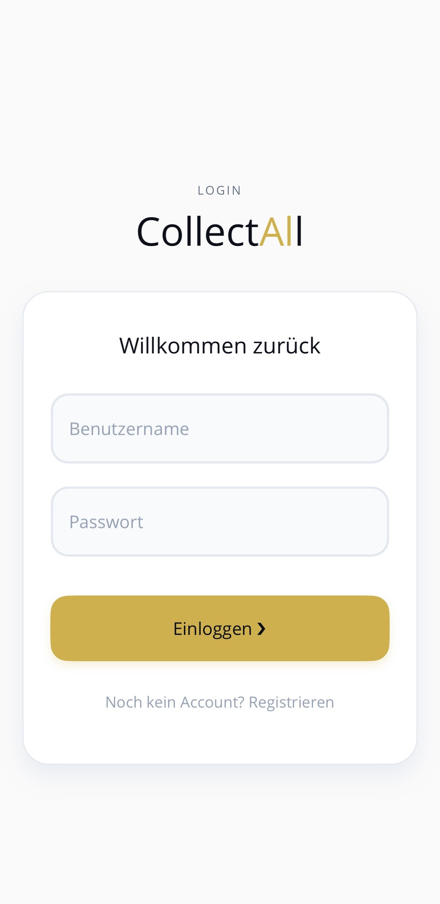
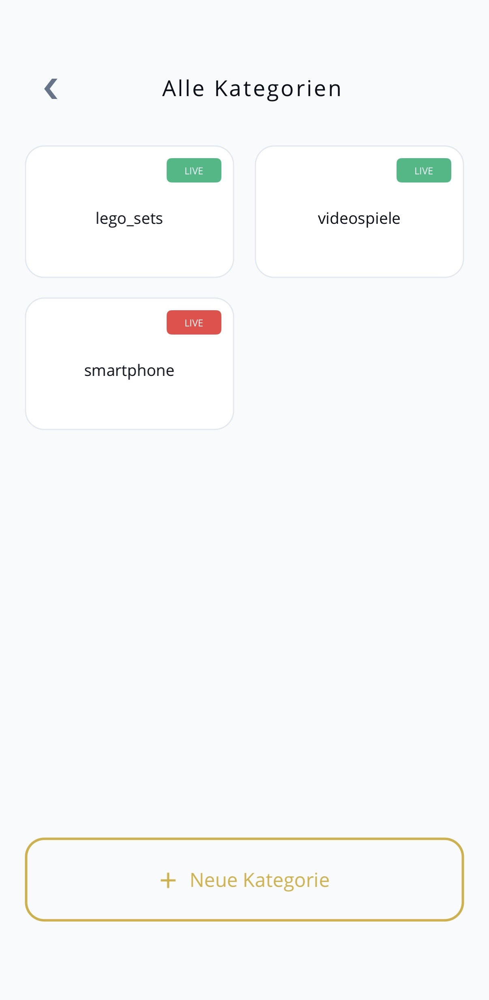
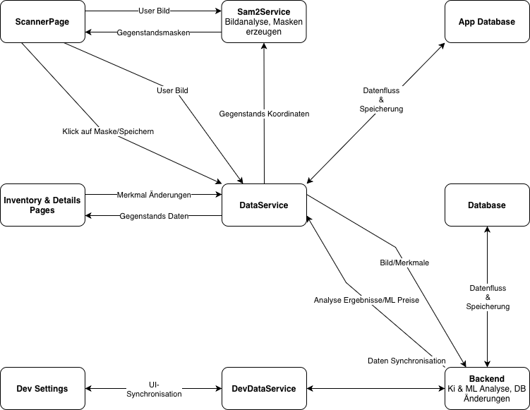

# CollectAll

Smartphone-App zur automatisierten Erkennung und Wertschätzung von Gegenständen per Kamera-Scan.

## Einleitung
CollectAll erkennt und segmentiert Gegenstände auf Fotos, schätzt deren Marktwert und speichert sie in einer lokalen Sammlung.

>🚧 Projekt-Status: 
> Der Quellcode dieses Projekts ist aktuell privat. Dieses Repository dient als Architektur-Dokumentation und Portfolio-Showcase.

### 🛠 Tech Stack

**Frontend**

**Backend**

**KI & Machine Learning**

**Cloud & Infrastruktur**

## App Demo
https://github.com/user-attachments/assets/f27da0ab-6f62-4416-a31b-f4659b67d5d7

## Features

### 1. Security & Auth
Architektur: Frontend + Always-On Azure Container App

Der Zugriff auf das Backend ist zweifach abgesichert:
* **User-Auth:** Login und Registrierung laufen stateless über **JWT Tokens**.
* **API-Schutz:** Alle Endpunkte prüfen zusätzlich einen App-spezifischen Schlüssel.

<table align="center">
  <tr>
    <td align="center" style="border: none;">
       
      Login
    </td>
    <td align="center" style="border: none;">
       
      Registrierung
    </td>
  </tr>
</table>

### 2. Kamera-Scan
Architektur: Frontend + Always-On Azure Container App

Die technische Basis des Scans bildet ein verteiltes System, das On-Device-Modelle für die Bildvorbereitung nahtlos mit skalierbaren Cloud-Diensten für die komplexe Datenanalyse verknüpft:

* **SAM 2 Tiny (Lokal):** Das Bild wird direkt auf dem Smartphone via Meta's SAM 2 Tiny Modell für die Segmentierung vorbereitet.
* **FastAPI & Gemini (Cloud):** Der Bildstring wird an das in Microsoft Azure gehostete Backend (Always-On) geschickt. Ein schnelles Gemini-Modell analysiert den Inhalt.
* **Microsoft Foundry Agent Trigger (Cloud):** Jeder Scan kann unter bestimmten Voraussetzungen einen Price Search Agenten im zweiten Backend (On-Demand) triggern.
* **11-stufiges Caching & Deterministisches Mapping (DE ↔ EN):** Um teure Datenbankabfragen zu minimieren und maximale Performance zu garantieren, werden Systemdaten in 11 separaten In-Memory-Caches vorgehalten. Darin integrierte relationale Lookup-Tabellen übersetzen Attribute vor dem Call ins Englische, um die Erkennungsgenauigkeit von Gemini zu maximieren, und mappen die Ergebnisse anschließend deterministisch und ohne Übersetzungsfehler zurück in das deutsche Schema.
* **Semantic Matching & Token-Reduzierung:** Gezielt für Gegenstandsnamen und offene Attribute (z. B. Filme) wird auf den Versand ressourcenintensiver Listen verzichtet. Die finale Zuweisung erfolgt zweistufig: Gemini generiert eine konzeptionelle Vorhersage, die anschließend von einer lokalen Vector Search-Pipeline (Sentence Transformer) semantisch dem korrekten Datensatz zugeordnet wird.
* **Koordinaten-Mapping:** Das Backend liefert Analysedaten basierend auf einer festen Feature-Struktur und Koordinaten zurück in das Frontend.
* **SVG-Masken:** SAM 2 erzeugt aus den Koordinaten SVG-Pfade, wodurch die Gegenstände im UI interaktiv hervorgehoben werden.
* **Validierung & SQLite:** Ein Klick auf eine Maske öffnet die Detailansicht. Hier können Merkmale angepasst werden (löst eine Neuschätzung aus), bevor der Gegenstand lokal in einer SQLite-Datenbank gespeichert wird.

### 3. Automatisierte Markt-Recherche (Scraping)
Architektur: On-Demand Azure Container App

Die Beschaffung realer Marktdaten erfolgt KI-gestützt und vollautomatisiert:

* **Microsoft Foundry Agent:** Sobald der Price Search Agent (GPT-5.6 Luna) getriggert wird, nutzt dieser dedizierte Websuch-Tools, um im Kontext der spezifischen Feature-Struktur bis zu 10 reale Preisreferenzen für den Gegenstand zu ermitteln.
* **Datenbank-Speicherung:** Die gefundenen Preisdaten werden auf Plausibilität und Redundanzen geprüft und anschließend persistiert in der Azure PostgreSQL-Datenbank abgelegt.

### 4. Machine Learning Pipeline
Architektur: Azure ML Cluster Job

Ein asynchroner, stündlicher Cluster-Job trainiert automatisiert XGBoost-Modelle für alle verfügbaren Gegenstandskategorien, um aktuelle Preisentwicklungen abzubilden, und versioniert diese in einem Azure Blob-Speicher.

### 5. Preisvorhersage & Fallback-Logik
Architektur: Always-On Azure Container App

Die finale Preisermittlung findet latenzoptimiert im Haupt-Backend statt:

* **Zweistufige Inferenz:** Jeder gescannte Gegenstand erhält dynamisch den Tag ml oder ai (abhängig von der aktuellen Datendichte der Kategorie). Bei ml wird das hochpräzise XGBoost-Modell aus dem Cache oder Blob-Speicher für die Vorhersage geladen.
* **Zero-Shot Fallback:** Bei zu geringer Datenlage (ai) greift das System als zuverlässigen Fallback direkt auf ein schnelles Gemini-Modell zurück, um dennoch eine valide (wenn auch heuristische) Sofortschätzung zu gewährleisten.

### 6. Sammlungsverwaltung & Navigation
Architektur: Frontend

Die App nutzt eine hierarchische Struktur zur effizienten Verwaltung der gespeicherten Gegenstände:

* **Sammlungs-Einstieg:** Von der Hauptseite aus gelangt der Nutzer in die globale Übersicht aller Kategorien.
* **Kategorie-Ansicht:** Innerhalb einer Kategorie werden alle zugeordneten Gegenstände als übersichtliche Kachel-Liste dargestellt.
* **Detail-Ansicht:** Ein Klick auf eine Kachel öffnet die vollständige Datenansicht (Bild, Name, Merkmale).
* **Mehrsprachigkeit:** Die Benutzeroberfläche ist komplett auf Deutsch und Englisch verfügbar. Die Sprache lässt sich nahtlos und ohne Neustart der App in den Einstellungen anpassen.

### 7. Wertentwicklung & Datenvisualisierung
Architektur: Frontend + Always-On Azure Container App

   
  Wertermittlung Beispiel 7 Tage

Die App aktualisiert und visualisiert den Marktwert der Sammlung kontinuierlich:  

* **Automatisierte Neuschätzung:** Ein App-Start triggert (gedrosselt auf maximal einmal pro Stunde) die automatische Neuschätzung aller gespeicherten Gegenstände durch die aktuellsten XGBoost-Modelle.
* **Portfolio-Graphen (Hauptseite):** Visuelle Darstellung der globalen Wertentwicklung der gesamten Sammlung.
* **Kategorie-Graphen:** Aggregierte Darstellung der historischen Preis-Trends einzelner Sammelgebiete.
* **Item-Graphen (Detail-Ansicht):** Detaillierter, historischer Preisverlauf für jeden individuellen Gegenstand.

### 8. Admin-Panel & Konfiguration
Architektur: Frontend + On-Demand Azure Container App

   
  Admin Übersicht

Ein rollenbasierter Zugriff schützt die Verwaltungsfunktionen auf der Hauptseite:  

* **Admin-Zugang:** Nur autorisierte Administratoren sehen den Einstellungs-Bereich.
* **Datenverwaltung:** Voller Lese- und Schreibzugriff auf alle Systemeinstellungen, Nutzerdaten und Kategorien.
* **Dynamisches Kategorie-Management:** Kategorien, deren spezifische Merkmale sowie die zulässigen Werte können flexibel zur Laufzeit angelegt und modifiziert werden. Auch die exakte Darstellung für den Endnutzer (UI-Labels) lässt sich nahtlos anpassen.
* **Automatisches Live-Deployment:** Die Freischaltung einer Kategorie triggert sofort ein globales Cache-Update. Parallel wird automatisiert ein XGBoost-Modell trainiert, sodass die App die neue Kategorie in Echtzeit und ohne Neustart erkennt.

### 9. Abo-Modell & Kategorien-Wahl
Architektur: Frontend + Always-On Azure Container App

   
  Kategorien Übersicht

Die App bietet verschiedene Abonnement-Stufen, die festlegen, wie viele Kategorien gleichzeitig vom System verarbeitet werden können.  

* **Dynamische Kategorie-Auswahl:** Aus einem Pool aller aktuell live geschalteten Kategorien können Nutzer – limitiert durch ihr jeweiliges Abo-Modell – ihr individuelles Set an aktiven Kategorien frei zusammenstellen, welche die App erkennen und speichern soll.

## Architektur & Datenfluss

   
  System-Architektur und Datenfluss

