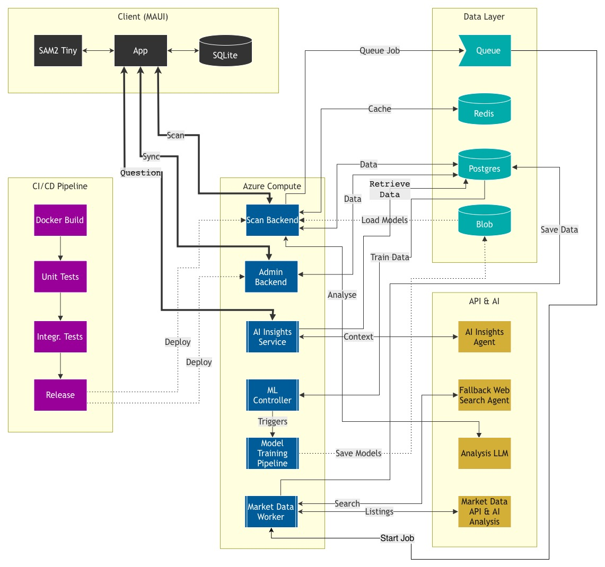
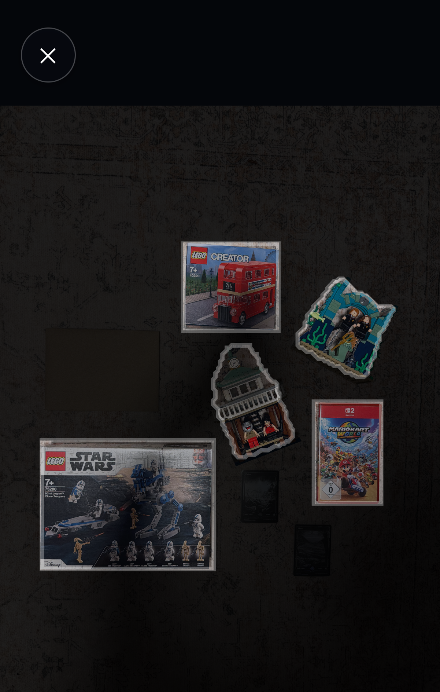
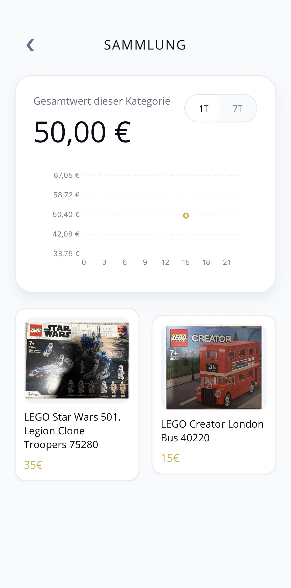
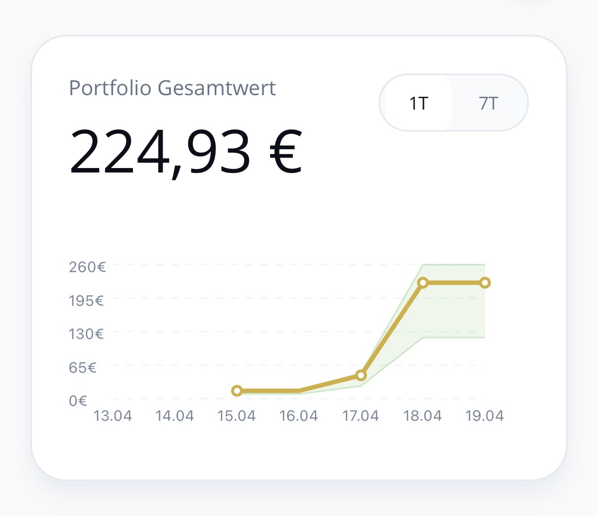
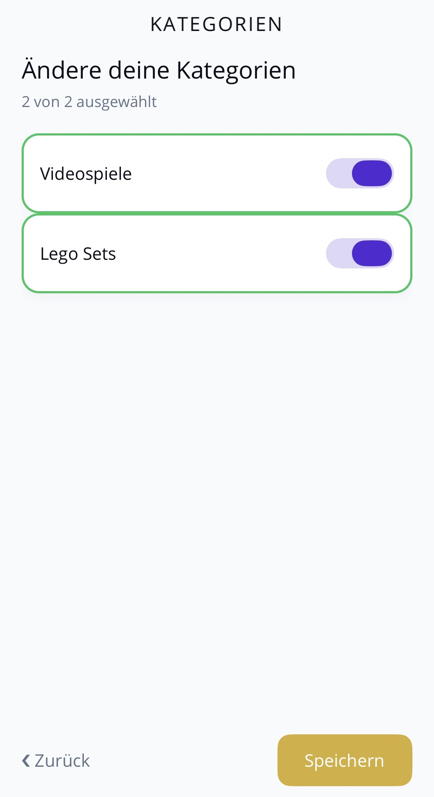
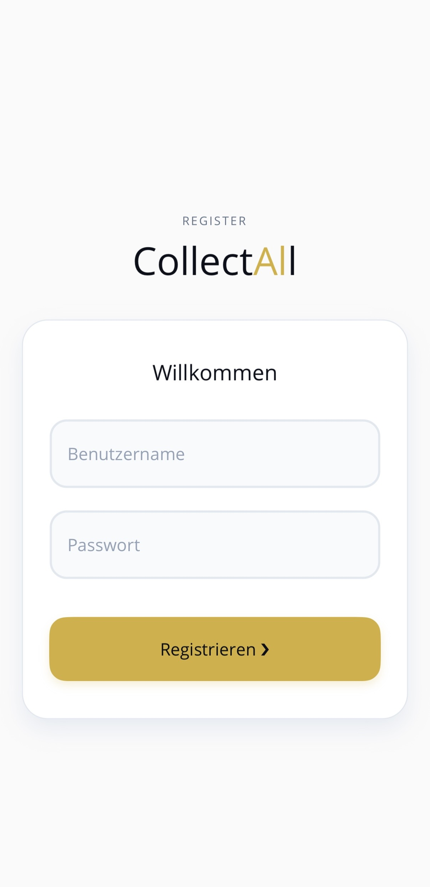
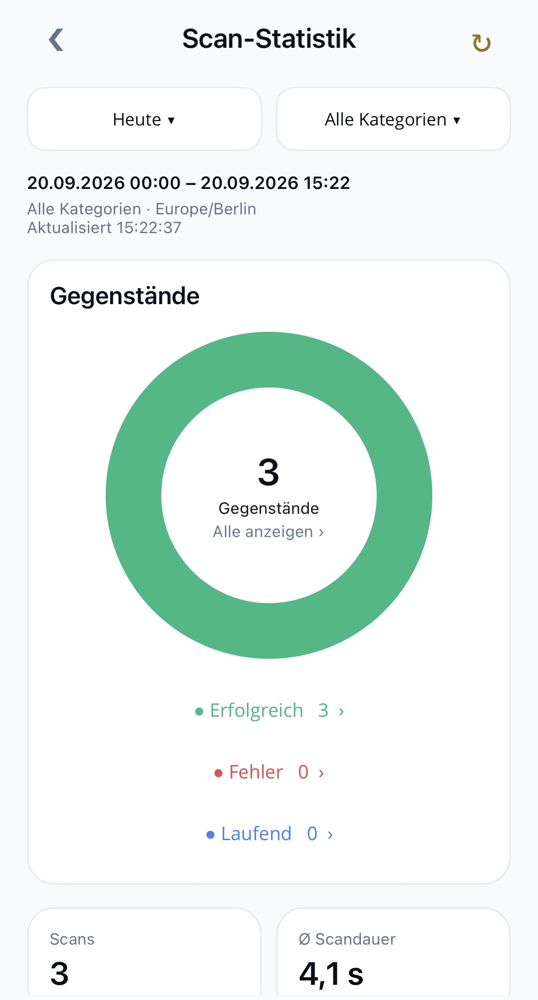
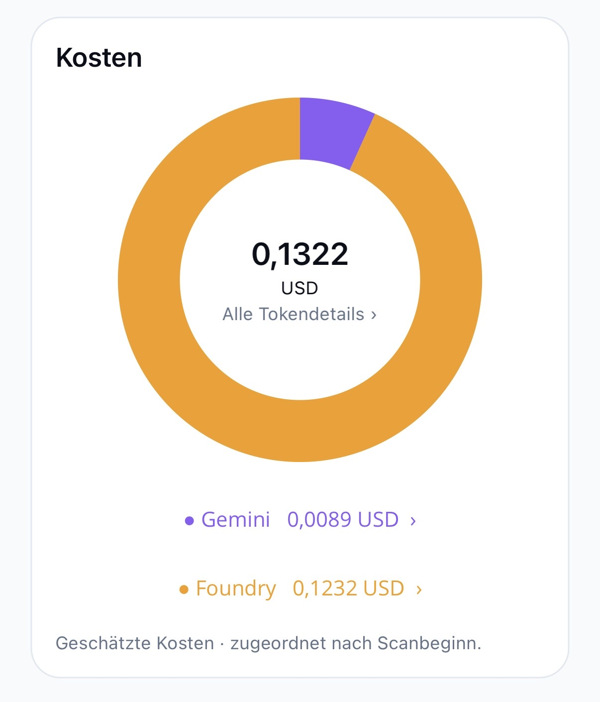

# CollectAll

**Verteiltes KI-System zur Edge-basierten Bildsegmentierung und automatisierten Erkennung und Marktwertschätzung von Gegenständen per Kamera-Scan.**

## App Demo
https://github.com/user-attachments/assets/91729379-4464-4555-9b41-2fad0eb0a9d6
> Im Video sind für diesen User-Account ausschließlich die Kategorien *Lego Sets* und *Videospiele* aktiv.

---

## Einleitung

CollectAll ist eine Full-Stack-Anwendung zur kamerabasierten Erfassung und Bewertung von Gegenständen. Eine On-Device-ML-Pipeline segmentiert mehrere Gegenstände innerhalb eines Bildes und ermöglicht deren gezielte Auswahl. Erkannte Gegenstände werden anhand kategorispezifischer Merkmale analysiert und durch trainierte ML-Modelle bewertet. Änderungen wertrelevanter Merkmale führen zu einer aktualisierten Schätzung.

> **Projekt-Status:** Der Quellcode dieses Projekts ist aktuell privat. Dieses Repository dient als Architektur-Dokumentation und Portfolio-Showcase für Systemdesign, KI-Integration und CI/CD-Pipelines.

### Tech Stack

**KI & Machine Learning**  

**Backend**  

**Cloud & Infrastruktur**  

**DevOps & CI/CD**  

**Frontend**  

---

## Systemarchitektur & Datenfluss

Das System basiert auf einer strikten Trennung zwischen mobilem Client, Backend-Services und asynchronen Workern, um Skalierbarkeit und Ausfallsicherheit zu gewährleisten.

   
  High-Level Architektur: Client, Cloud Compute, Data Layer & Pipelines

### Architektur & Design-Entscheidungen

Dieses Projekt wurde mit Fokus auf Kostenoptimierung, Latenzreduzierung und Ausfallsicherheit entworfen:

* **Edge-Compute & Asynchrone Parallelisierung (SAM 2 via ONNX):** 
Die rechenintensive Generierung der Bild-Embeddings für die Segmentierung wurde als ONNX-Modell auf das Endgerät des Nutzers ausgelagert. Diese lokale Edge-Inferenz läuft asynchron und parallel zur KI-Analyse im Backend. 
**Problem & Lösung:**  
  Um den Scan-Vorgang durch überlappende Ladezeiten zu beschleunigen und nutzerproportionale Compute-Ressourcen (GPUs) im Azure-Backend zu vermeiden, wird die schwere Rechenlast stabil auf die Client-Geräte verteilt.
  
* **LLM-Skalierung: Context Caching & Semantic Matching:** 
Um das System bei einer wachsenden Anzahl an Kategorien kosteneffizient und performant zu halten, trennt die Architektur statische und scanabhängige Kontextinformationen. Wiederverwendbare Prompt-Anteile werden gecacht, während pro Scan nur die tatsächlich benötigten dynamischen Informationen verarbeitet werden. 
**Problem & Lösung:**  
  Eine direkte Übergabe großer Referenzlisten bekannter Gegenstände an das LLM würde Tokenverbrauch und Latenz mit wachsendem Datenbestand stark erhöhen. Stattdessen erzeugt die KI eine freie Objektbezeichnung, die das Backend anschließend über semantisches Matching fehlertolerant einem bekannten Datenbankeintrag zuordnet. Dadurch bleibt die Analyse auch bei großen Datenbeständen performant, ohne umfangreiche Referenzdaten in jedem Request übertragen zu müssen.

* **Distributed Caching & Concurrency Control (Redis):** 
Um Latenzen zu minimieren und denselben Datenstand über mehrere zustandslose Backend-Replikate hinweg zu garantieren, werden Systemdaten in über 10 logisch getrennten Cache-Bereichen in Redis vorgehalten. 
**Problem & Lösung:**  
  Bei gleichzeitig eintreffenden Scans unbekannter Gegenstände durch verschiedene Nutzer drohen Race Conditions und damit mögliche Duplikate in der Datenbank. Das System nutzt deshalb einen Cache-First Lookup mit transaktionalem Re-Check: Die rechenintensive Embedding-Generierung und der erste Lookup erfolgen lock-free gegen den Redis-Cache. Nur bei einem Cache Miss wird eine kurze PostgreSQL-Transaktion (Pessimistic Locking) geöffnet, ein zweiter Check direkt auf der Datenbank ausgeführt und erst dann persistiert. Dadurch werden konkurrierende Schreibvorgänge kontrolliert, ohne die Performance für bereits bekannte Gegenstände auszubremsen.

* **Adaptive Modellwahl & automatisiertes Retraining (Azure ML AutoML):** 
Für jede Kategorie überwacht eine automatisierte ML-Pipeline das Wachstum der Trainingsdaten. Bei moderatem Datenzuwachs wird das bestehende Produktionsmodell mit seiner aktuellen Konfiguration neu trainiert. Bei größerem Datenzuwachs wird erneut Azure ML AutoML ausgeführt, um geeignete Regressionsalgorithmen und Hyperparameter zu vergleichen. Das ausgewählte Modell wird anschließend über eine einheitliche Preprocessing- und Deployment-Pipeline neu trainiert, versioniert und für die Preisprognose bereitgestellt. 
**Problem & Lösung:**  
  Ein festgelegter Algorithmus ist nicht dauerhaft für jeden Datenbestand optimal, während ein vollständiger AutoML-Lauf nach jeder kleinen Datenänderung unnötige Compute-Kosten verursachen würde. Das System trennt deshalb kostengünstiges Retraining von der aufwendigeren Modellselektion. So bleibt das Produktionsmodell auf dem aktuellen Datenstand und AutoML prüft nur bei ausreichend neuen Daten, ob ein besser geeignetes Modell oder andere Hyperparameter verfügbar sind.

* **Hybride Marktdaten-Beschaffung (Tiered Fallback):** 
Zur kosteneffizienten Beschaffung realer Marktdaten kombiniert das System strukturierte Datenquellen mit einer KI-gestützten Webrecherche. Primär werden verfügbare strukturierte Marktdaten verarbeitet; nur bei unzureichender Datenlage wird eine breitere Recherche ausgelöst. Die Ergebnisse werden anschließend merkmalsbezogen validiert und für die ML-Pipeline aufbereitet. 
**Problem & Lösung:**  
  Marktrecherche kann sowohl zeit- als auch kostenintensiv sein und soll den eigentlichen Scan-Prozess nicht blockieren. Deshalb erfolgt die Verarbeitung entkoppelt über eine asynchrone Queue- und Job-Pipeline in Azure. Validierte Marktdaten stehen anschließend unabhängig vom Scan-Prozess für Modelltraining und Preisaktualisierungen zur Verfügung.

* **Dynamic Data Modeling & Server-Driven Architecture:** 
Das System ermöglicht die Erstellung und Modifikation neuer Gegenstandskategorien und ihrer Merkmale zur Laufzeit über ein Admin-Panel. Die dafür benötigten Datenstrukturen, Analysekonfigurationen und Client-Darstellungen werden dynamisch aus zentralen Kategoriedefinitionen abgeleitet. 
**Problem & Lösung:**  
  Neue Kategorien sollen ohne erneuten App-Release bereitgestellt werden können. Deshalb nutzt das System eine Server-Driven Architecture, bei der UI-Konfigurationen, zulässige Merkmalswerte und Analyseparameter dynamisch an die Clients übertragen werden. Eine gezielte Cache-Invalidierung stellt dabei sicher, dass Änderungen konsistent übernommen werden.

### DevOps & CI/CD Pipeline

Die Deployment-Pipeline wird durch einen Merge in den `main`-Branch ausgelöst und durchläuft eine dreistufige Validierung, um fehlerhafte Deployments zu verhindern:

* **Phase 1: Unit Tests & Image Build (Sandbox):** Der Code wird zunächst in einer isolierten Build-Stage validiert. `pytest-socket` blockiert Netzwerkzugriffe während der Tests, um unbeabsichtigte externe API-Aufrufe zu verhindern. Externe Services werden gemockt, Datenbanktests laufen gegen SQLite In-Memory. Nach erfolgreichem Abschluss aller Tests wird das Docker-Image gebaut.
* **Phase 2: Automated Integration Testing (Azure Container Apps Jobs):** Die Pipeline startet automatisch einen Azure Container Apps Job, der das erzeugte Image gegen eine separate Testumgebung validiert, einschließlich Datenbank-Migrationen und Service-Kommunikation.
* **Phase 3: Production Deployment (Revision Gating):** Erst nach erfolgreichem Integrationstest wird das validierte Image als neue **Azure Container App Revision** ausgerollt (Zero-Downtime).
---

## Hauptfunktionen & UX

### 1. Kamera-Scan & Interaktive Multi-Object-Erkennung

   
  On-Device-Segmentierung via SAM 2

Die App segmentiert mehrere Gegenstände innerhalb eines Bildes und legt interaktive Masken über die erkannten Objekte. Nutzer können einen Gegenstand gezielt auswählen und erhalten anschließend die erkannten Merkmale sowie eine erste Marktwertschätzung.

### 2. Sammlungsverwaltung & Merkmalsbasierte Neubewertung

   
  Kachel-Ansicht der Sammlung

Eine hierarchische Struktur bietet eine globale Übersicht über alle aktiven Kategorien, kategoriebasierte Sammlungsansichten und Detailseiten einzelner Gegenstände. Erkannte Merkmale können nachträglich angepasst werden; wertrelevante Änderungen führen automatisch zu einer aktualisierten Modellschätzung.

### 3. Automatisierte Markt-Recherche & Preis-Updates

Im Hintergrund werden reale, merkmalsbezogene Marktdaten recherchiert und für die Preisbewertung aufbereitet. Neue Marktdaten fließen unabhängig vom Scan-Prozess in zukünftige Modellschätzungen und Preisaktualisierungen ein.

### 4. Wertentwicklung & Datenvisualisierung

   
  Wertermittlung Beispiel 7 Tage

Nutzer können die historische Wertentwicklung ihrer gesamten Sammlung sowie einzelner Kategorien und Gegenstände analysieren.

### 5. Dynamische Kategorien-Auswahl

   
  Kategorien Übersicht

Nutzer können aus den serverseitig freigeschalteten Gegenstandskategorien individuell auswählen, welche Bereiche in ihrer App aktiv sein sollen.

### 6. Mehrsprachigkeit (On-the-Fly)

Die Benutzeroberfläche und dynamische Inhalte können direkt in den Einstellungen zwischen Deutsch und Englisch umgeschaltet werden – ohne Neustart der App.

### 7. User-Accounts & Data Security

   
  Nutzer-Registrierung

JWT-basierte Authentifizierung schützt den Zugriff auf benutzerspezifische Backend-Funktionen. Persönliche Sammlungsdaten werden lokal in SQLite auf dem Endgerät gespeichert.

### 8. Admin-Dashboard & Live-Analytics

<table align="center">
  <tr>
    <td align="center" style="border: none;">
       
      Live Scan-Statistik
    </td>
    <td align="center" style="border: none;">
       
      API Kosten-Monitoring
    </td>
  </tr>
</table>

Administratoren können Kategorien, Merkmale und UI-Konfigurationen zur Laufzeit verwalten und freischalten. Das Dashboard visualisiert zusätzlich technische Kennzahlen wie Scan-Dauer, Verarbeitungsvolumen und API-Kosten.

---

## Roadmap

- **AI Price Insights:** Kontextbezogene Analyse und Erklärung von Preisprognosen, Merkmalen, Vergleichsdaten und Preisänderungen.
